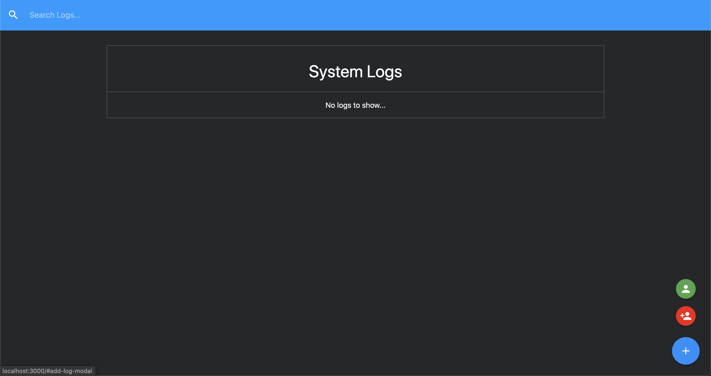

# IT Logger

A simple logger to track issues in an IT department. Can have multiple technicians, and issues.

# Technologies Used

1. react 16.13.1
2. redux 4.0.5
3. react-redux 7.2.0
4. redux-thunk 2.3.0
5. redux-devtools-extension 2.13.8
6. materialize-css 1.0.0

# Features

1. Can keep track of multiple issues across different workstations.
2. Search functionality makes it easy to lookup a specific active, or resolved issue.
3. Multiple technitians can be added.
4. Technicians automatically appear in dropdown to easily assign them to an issue once added.

# Installation

1. Clone the repo `git clone https://github.com/tarricsookdeo/it-logger.git`
2. CD into project directiory `cd it-logger`
3. Install npm packaged by running `npm install`
4. Run `npm run dev` to launch react server along with json-server. By default the react server launches on port 3000 at `http://localhost:3000/` and json-server launches on `http://localhost:5000/`
5. (optional) The project uses the redux dev tools in the google chrome extenstions store. `https://chrome.google.com/webstore/detail/redux-devtools/lmhkpmbekcpmknklioeibfkpmmfibljd?hl=en-US`

# How To Use

When the app is first loaded you will be greeted with this screen:

Hover over the blue add button on the right hand bottom of the screen, and a green and red button will also appear.

- Blue button is used to add a new issue.
- Red button is used to add a new tech.
- Green button is used to list the techs, and from here techs can also be deleted.
  
